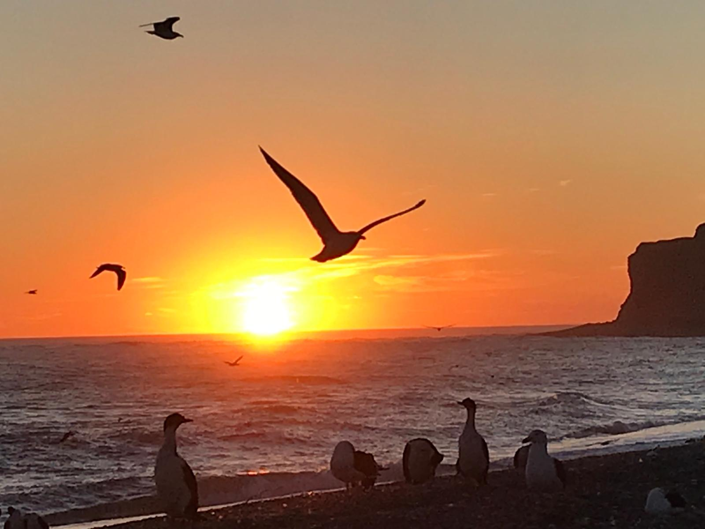
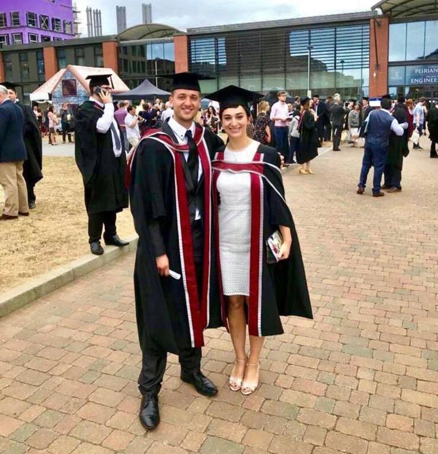
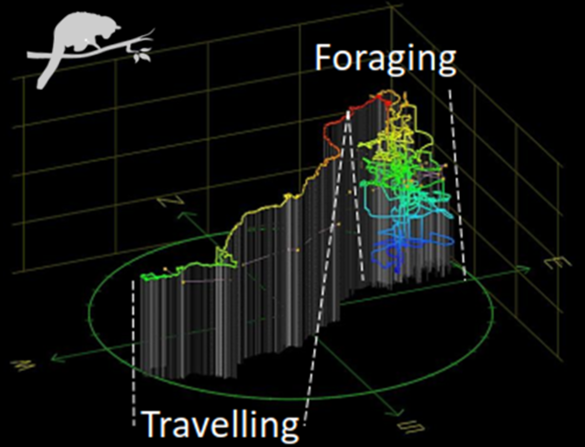
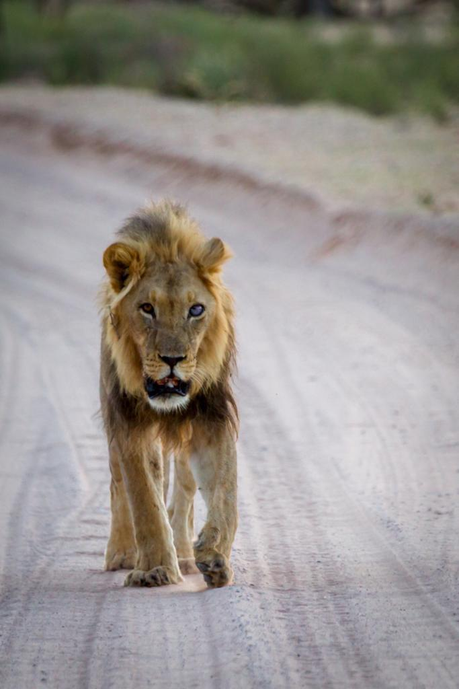
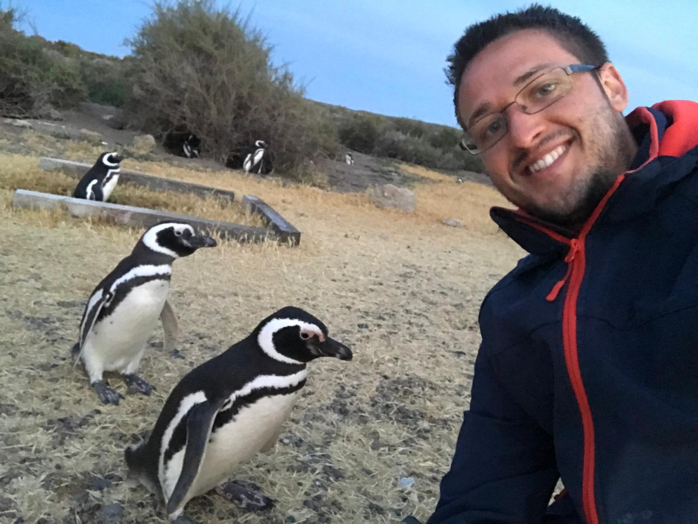
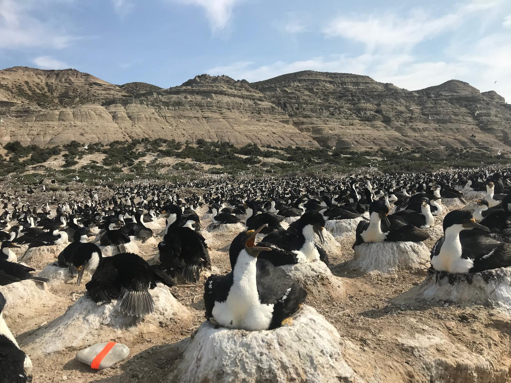
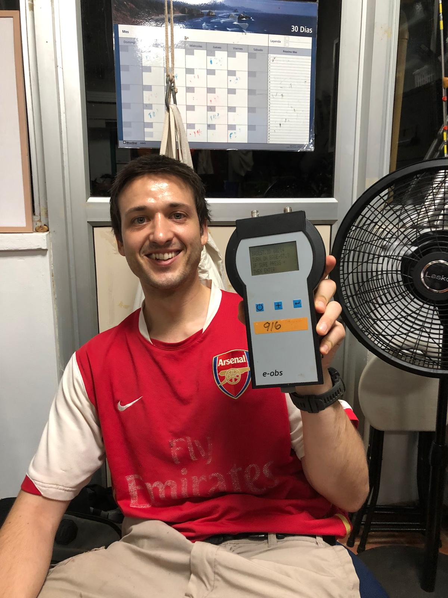
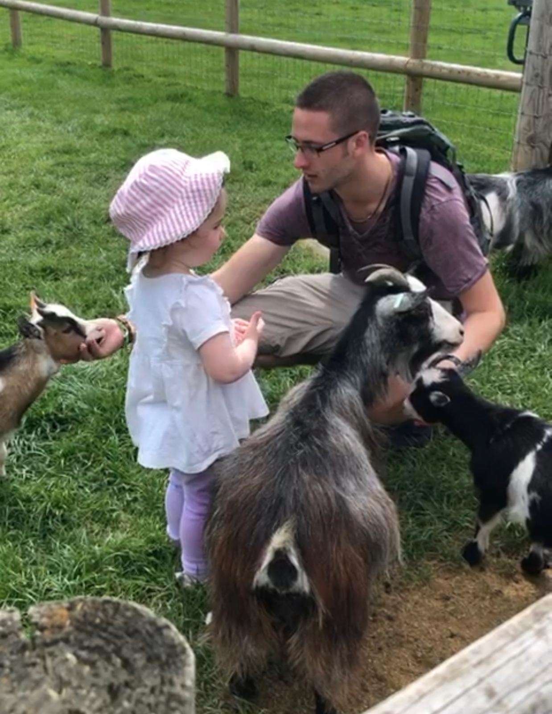

# About Me

From a young age, I was captivated by the natural world, inspired by the infectious enthusiasm of the late Steve Irwin and the awe-inspiring documentaries of Sir David Attenborough. This passion for wildlife led me to pursue a Bachelor’s degree in Zoology at Swansea University, where I graduated with First Class Honours. My fascination with understanding animal movement and behavior deepened during my studies, encouraging me to continue my academic journey with a Master of Research (MRes) and a PhD under the guidance of the renowned Prof. Rory Wilson.

{: width="90%"}

Currently, I am a postdoctoral researcher at the Max Planck Institute of Animal Behavior in Germany, working in the Department for the Ecology of Animal Societies under Prof. Dr. Meg Crofoot. My research focuses on the cutting-edge analysis of animal movement using advanced biotelemetry tools, combining GPS, IMU, and sensor technologies to uncover the behavioral strategies of terrestrial, arboreal, aerial, and marine species.

Throughout my career, I’ve led and contributed to several interdisciplinary research projects, from the dense jungles of Panama tracking neotropical frugivores to the arid landscapes of South Africa tagging African lions. These experiences have not only honed my technical skills but also deepened my commitment to ethical and impactful science.

# Academic Journey

- Postdoctoral Researcher (2021–present): Max Planck Institute of Animal Behavior, Germany.

- PhD in Biosciences (2018–2021): Swansea University, Wales, UK.  
  Dissertation: "A new direction for differentiating animal activity based on measuring angular velocity about the yaw axis."

- Master of Research (MRes) (2016–2018): Swansea University.

- Bachelor’s in Zoology (2013–2016): Swansea University, First Class Honours.

{: width="70%"}

# Research Highlights

- Comparative Foraging Strategies of Neotropical Frugivore Guilds (Panama):  
  Designed and implemented protocols to track high-resolution 3D movements of 10 species using GPS-IMU technologies.

{: width="50%"}

- Dead-Reckoning Animal Movement in R:  
  Developed and refined analytical frameworks for reconstructing movement paths using animal-borne sensors.

- African Lions in Kgalagadi, South Africa:  
  Conducted large-scale tagging efforts, collecting high-resolution data across four prides over six months to study their movement ecology.

{: width="70%"}

- Penguins and Cormorants in Argentina:  
  Tagged and retrieved data from over 70 birds to investigate foraging patterns and movement efficiency.

  
  

# Passions Beyond Research

When I’m not in the field chasing data or debugging code, I enjoy sharing my knowledge through teaching, mentoring, and collaborating on multidisciplinary projects. I am committed to fostering inclusivity in research and enhancing local capacity in the regions where I work. 

Beyond this, I like to spend my time indulging in some more... grounded pursuits. As an unfortunate, yet loyal Arsenal FC supporter, I have embraced the highs and lows of the beautiful game (though with a surname like Gunner, what other team could I possibly support?). On the flip side, I’ve also taken to golf—a sport where I can combine my love for precision with the occasional frustration of losing a ball in the rough!

  
  

