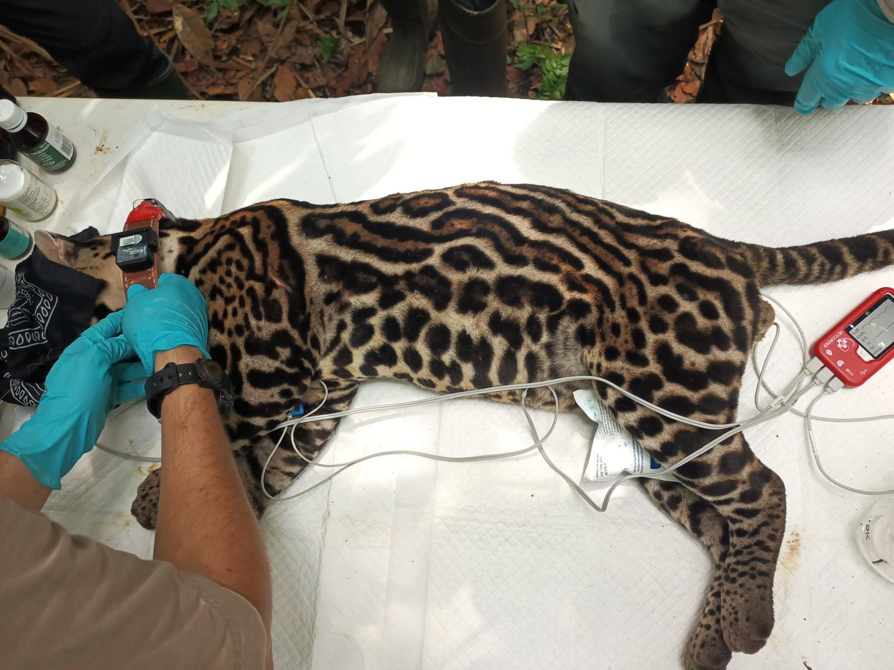
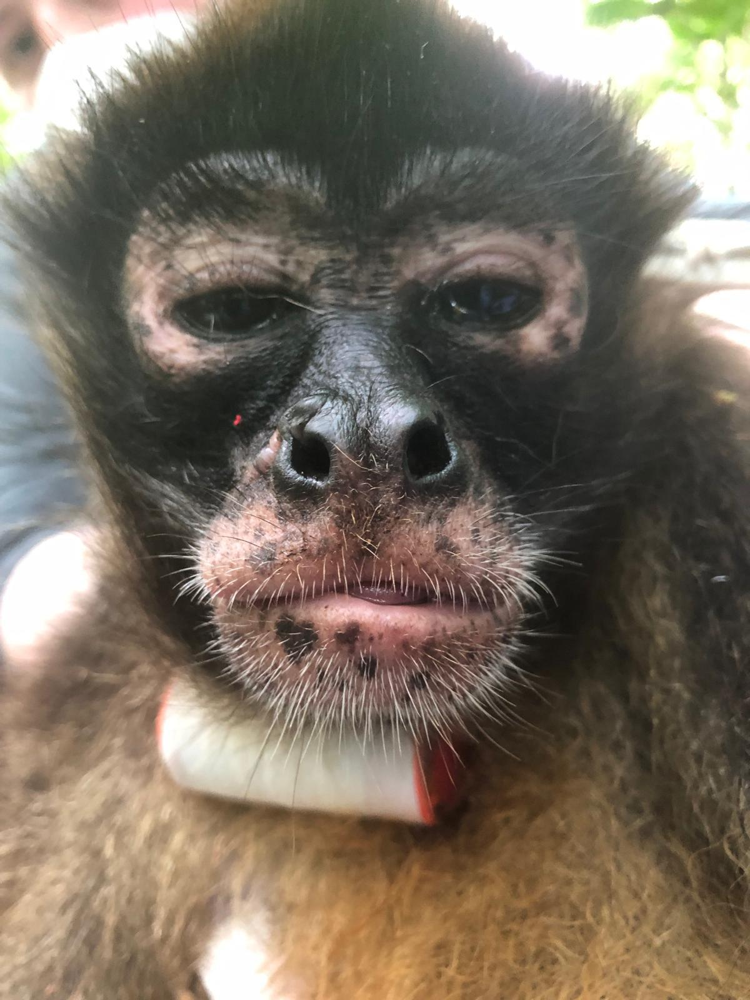

# Current Project
### Mapping Animal Movement Lattices: Integrating High-Resolution Tracking and LiDAR in a Tropical Ecosystem

- **Principal Investigator**: Dr. Richard Gunner
  
- **Supervisor**: Prof. Meg Crofoot
  
- **Key field collaborators**: Josue Ortega and Lucia Torrez

## Primary Hypothesis:
Animals navigate their home ranges using species-specific, probabilistic movement lattices that are significantly influenced by environmental structures and interspecific interactions. By combining high-resolution LiDAR data with GPS, dead-reckoning, weather, and behavioral data, this project aims to uncover these intricate patterns of animal behavior.

## Project Overview:
This project explores how animals traverse complex ecosystems like tropical forests by integrating environmental data with movement tracking. Using drone- and backpack-mounted LiDAR systems, we map the physical structure of the environment, including terrain ruggedness, vegetation density, and canopy connectivity. Simultaneously, animal-borne IMU-GPS loggers capture high-resolution 3D movement data, enhanced with pressure sensors for vertical dimension mapping.

  
  

## Key questions we aim to answer include:
- Can we identify well-defined animal "highways" or movement lattices within a home range? What proportion of species-specific movement can be attributed to defined movement lattices versus random or diffusive movement patterns?

- How do environmental factors, such as terrain ruggedness, canopy connectivity, and tree height variance, influence the formation and utilization of movement lattices for both terrestrial and arboreal species?

- What role do interspecies interactions and predator-prey dynamics play in shaping these routes? How does the proximity of predators or prey affect an animal's utilization of its movement lattice? Do animals modify their pathways to optimize survival in response to predation risk?

- How does a lattice-based movement pattern impact encounter rates between interacting species, including predator-prey interactions and resource competition?

- Can we develop probabilistic models that predict behavior-specific route selection based on localized environmental conditions and interspecific interactions?

By moving beyond traditional diffusive models of animal movement, this study proposes a novel "lattice framework" for understanding how animals optimize their navigation and energy expenditure in diverse environments.

Applications:
Redefining food/predator encounter probabilities and species interactions.
Developing new tools for predicting animal movement and enhancing computational frameworks for studying animal movement ecology.

  
  

  
  

  
  

<video controls width="auto" height="auto">
  <source src="{{ '/assets/images/Spidervid2.mp4' | relative_url }}" type="video/mp4">
  Your browser does not support the video tag.
</video>

  <video controls width="45%">
    <source src="{{ '/assets/images/Spidervid1.mp4' | relative_url }}" type="video/mp4">
    Your browser does not support the video tag.
  </video>
  <video controls width="45%">
    <source src="{{ '/assets/images/slothvid.mp4' | relative_url }}" type="video/mp4">
    Your browser does not support the video tag.
  </video>

